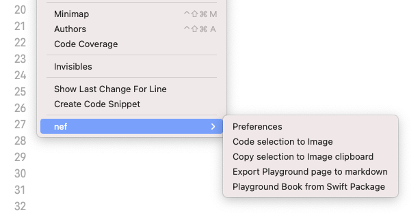

    

    
    
    
    

&nbsp;

It is a plugin for Xcode to integrate some of the nef's features directly in the IDE. Using the core of `nef`, you can [export snippets](https://github.com/bow-swift/nef#-exporting-carbon-code-snippets) from your code selection directly in Xcode.

&nbsp;

## 📥 Installation

You can install `nef` plugin from [Mac App Store](TODO) or download the last binary from the [releases](https://github.com/bow-swift/nef-plugin/releases) section.

To complete the installation, you should enable `nef` extension from `System Preferences > Extensions > Xcode Source Editor`

    

## 🌁 Export code selection to snippet

In Xcode you can find the nef plugin options in `Editor`. 

If you want to export your current code selection into a snippet, you only need to select the action `Editor > nef > Export code snippet`

&nbsp;

    

## 🔨 Xcode navigation keyboard shortcuts

To make you a more productive developer, you can associate a keyboard shortcut to each `nef` action. 
Open the shortcut menu in `Xcode > Preferences... > Key Bindings` and set your command.

    

# ⚖️ License

    Copyright (C) 2019 The nef Authors

    Licensed under the Apache License, Version 2.0 (the "License");
    you may not use this file except in compliance with the License.
    You may obtain a copy of the License at

       http://www.apache.org/licenses/LICENSE-2.0

    Unless required by applicable law or agreed to in writing, software
    distributed under the License is distributed on an "AS IS" BASIS,
    WITHOUT WARRANTIES OR CONDITIONS OF ANY KIND, either express or implied.
    See the License for the specific language governing permissions and
    limitations under the License.
