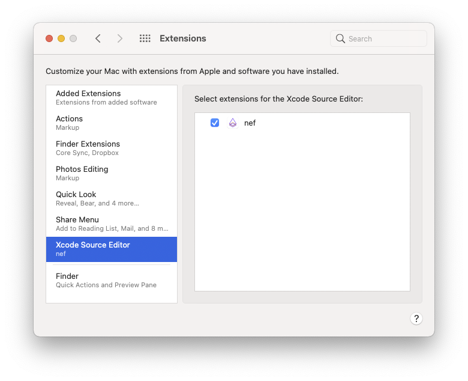
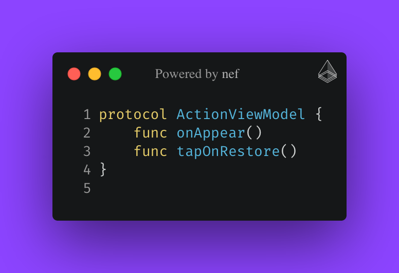
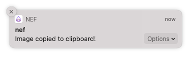
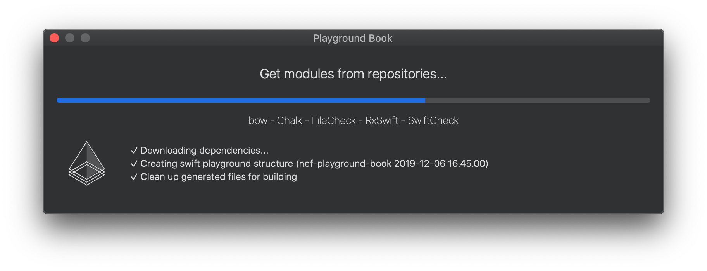
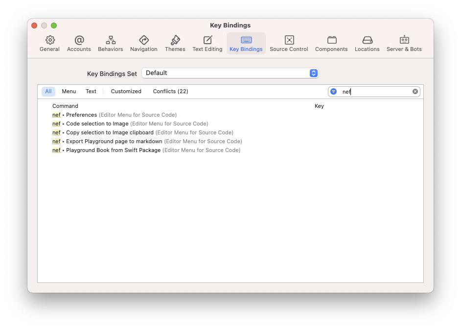

    

    
    
    
    
    

&nbsp;

This project provides an extension for Xcode to integrate some nef features directly in the IDE. Using the core of `nef`, you can [export snippets](https://github.com/bow-swift/nef#-exporting-carbon-code-snippets) from your code selection directly in Xcode.

### Features

💡 Exports a [__code selection__](#-export-code-selection-to-image-or-clipboard) to image or clipboard.

💡 Generates [__Markdown__](#-generates-markdown-file-from-playground) files from Xcode Playground.

💡 Builds a [__Playground Book__](#-create-a-playground-book-from-your-swift-package) with external dependencies defined in a Swift Package.

&nbsp;

## 💻 Installation

#### ➊ Latest binary in [Releases section](https://github.com/bow-swift/nef-plugin/releases/latest/download/nef-installer.dmg) (preferred)
#### ➋ Using [Mac App Store](https://apps.apple.com/app/nef/id1479391704?mt=8)

> To complete the installation, you should enable `nef` extension from `System Preferences > Extensions > Xcode Source Editor`

    

&nbsp;

## Usage

You can find the nef plugin options in `Xcode > Editor`

### 🔧 Preferences

You can customize the output image using the preferences action `Editor > nef > Preferences`

    

&nbsp;

### 🌁 Export code selection to image or clipboard
You can export your current code selection into a snippet, you only need to select the action `Editor > nef > Code selection...`
- **Image file** it will create an image in the [output folder](#-preferences).
- **Image clipboard** it lets you take advantage of the [universal clipboard](https://support.apple.com/en-us/HT209460).

#### Output
 <table>
  <tr>
    <th align="center" width="50%">
        
    </th>
    <th align="center" width="50%">
        
    </th>
  </tr>
</table>

&nbsp;

### 📃 Generates markdown file from Playground

Xcode Playgrounds let you write comments in markdown format using the symbols //: for single line comments, or /*: */ for multiline comments. Markup for playgrounds includes page level formatting for headings and other elements, formatting spans of characters, showing inline images, and several other features. You can read more in the [Markup Formatting Reference](https://developer.apple.com/library/archive/documentation/Xcode/Reference/xcode_markup_formatting_ref/index.html).

You can create a markdown file from playground page with the nef action `Editor > nef > Export Playground page to markdown`

&nbsp;

### 📲 Create a Playground Book from your Swift package

You can create a Playground compatible with you iPad from a Swift package. You only need to open the swift package in Xcode,
and select the action `Editor > nef > Playground Book from Swift Package`

It will ask you where to save the Playground Book, and it will start to build it.

    

> This feature needs to use Swift Package Manager tool. Consequently, it will need to disable the sandbox thus it is not allowed in the App Store; but if you want to enjoy this feature, you only need to install the `.dmg` you'll find in the [releases](https://github.com/bow-swift/nef-plugin/releases) section.

&nbsp;

## 🔨 Xcode navigation keyboard shortcuts

To make you a more productive developer, you can associate a keyboard shortcut to each `nef` action.
Open the shortcuts menu in `Xcode > Preferences... > Key Bindings` and set your command.

    

## ⚖️ License

    Copyright (C) 2019-2020 The nef Authors

    Licensed under the Apache License, Version 2.0 (the "License");
    you may not use this file except in compliance with the License.
    You may obtain a copy of the License at

       http://www.apache.org/licenses/LICENSE-2.0

    Unless required by applicable law or agreed to in writing, software
    distributed under the License is distributed on an "AS IS" BASIS,
    WITHOUT WARRANTIES OR CONDITIONS OF ANY KIND, either express or implied.
    See the License for the specific language governing permissions and
    limitations under the License.
